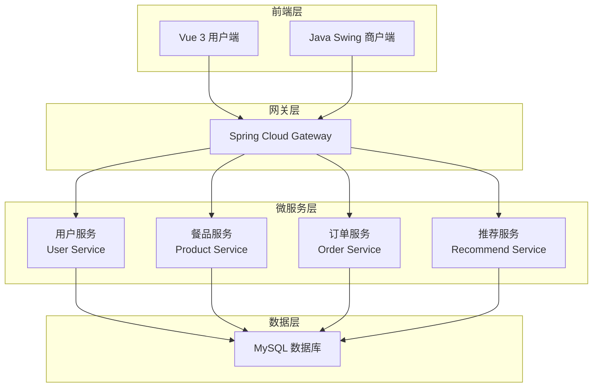
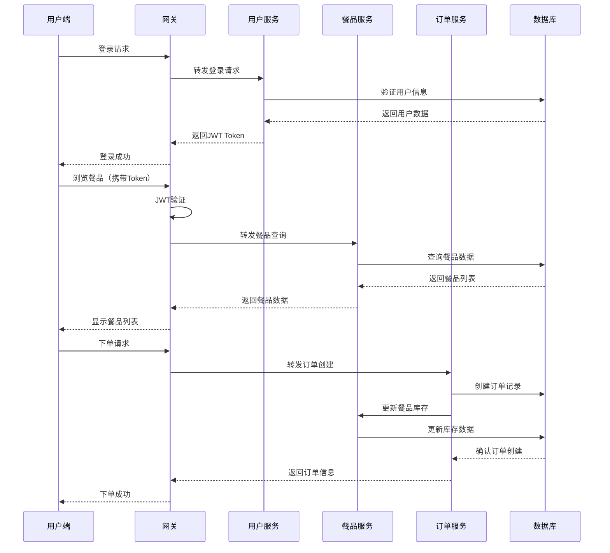
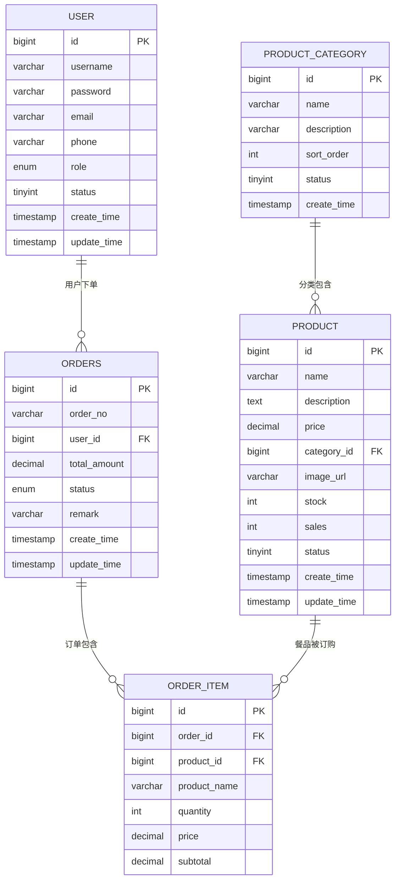
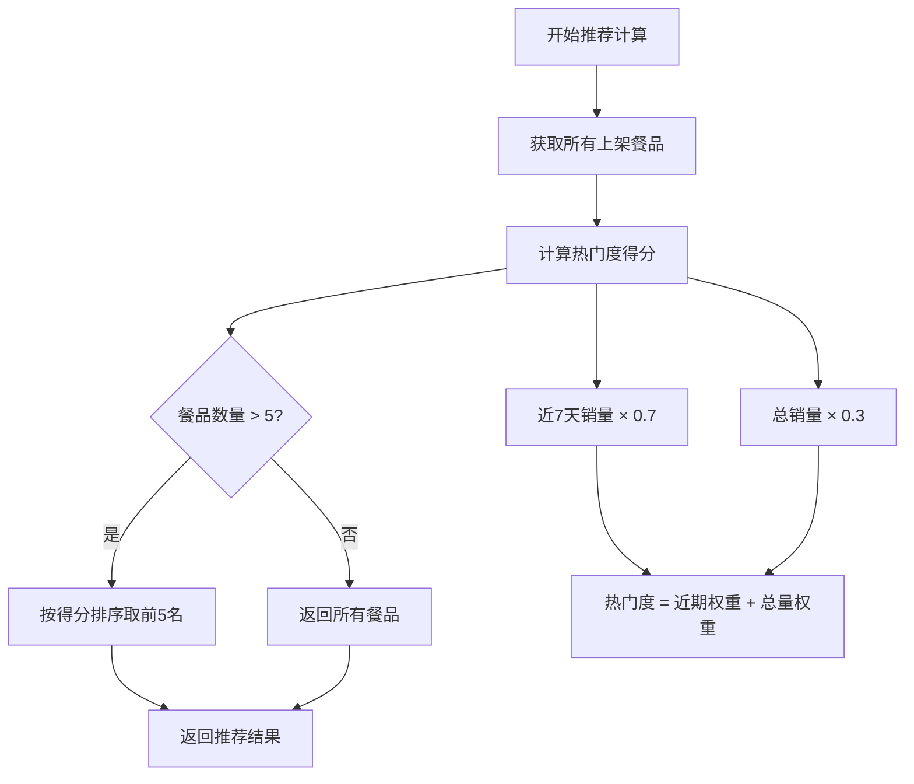
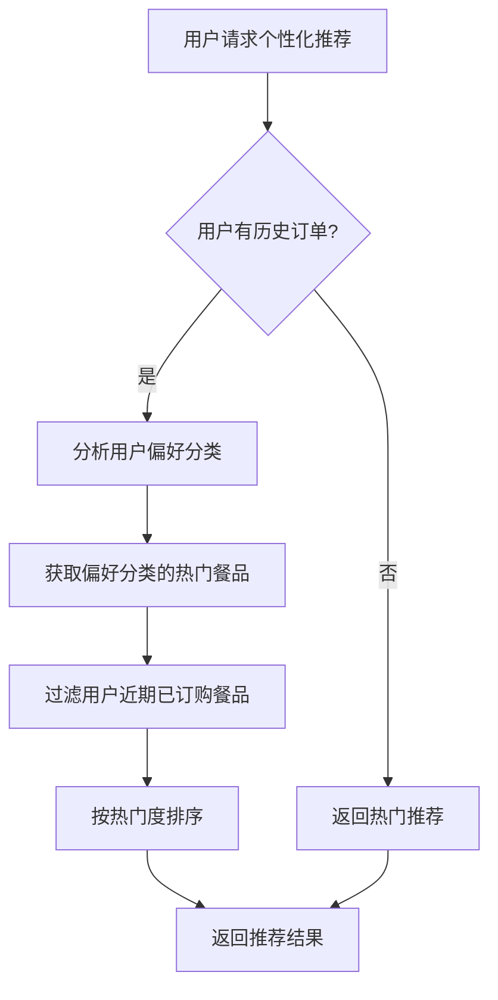
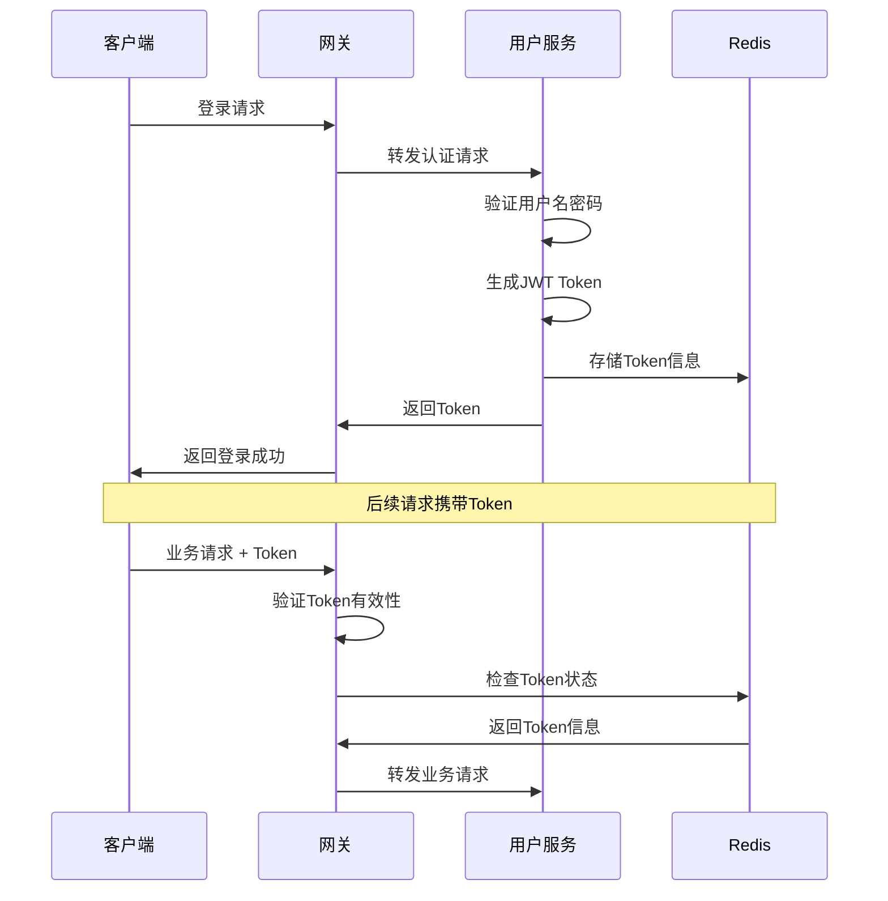

# 高校食堂订餐系统需求分析与技术栈设计文档

## 1. 项目概述

### 1.1 项目背景
高校食堂订餐系统旨在解决传统食堂排队时间长、就餐高峰期拥堵、订餐流程繁琐等问题，为学生和教职工提供便捷的在线订餐服务。

### 1.2 项目目标
- 提升就餐效率和用户体验
- 实现前后端分离的现代化架构
- 采用微服务架构便于后期扩展
- 保证系统功能简单可用，能够稳定运行

### 1.3 目标用户
- **主要用户**: 高校学生和教职工
- **商户端**: 食堂管理人员
- **管理端**: 系统管理员（后期扩展）

## 2. 功能需求分析

### 2.1 用户端功能模块

#### 2.1.1 用户认证模块
- **用户注册**: 账号注册，基本信息录入
- **用户登录**: 账号密码登录，JWT Token鉴权
- **用户信息管理**: 查看和修改个人信息

#### 2.1.2 在线订餐模块
- **餐品浏览**: 按分类查看食堂餐品（分类、价格、图片）
- **餐品搜索**: 支持按名称、分类搜索餐品
- **下单功能**: 选择餐品、数量、添加备注
- **购物车**: 临时存储选择的餐品

#### 2.1.3 订单管理模块
- **订单查询**: 查看订单列表（待支付、已支付、已完成、已取消）
- **订单详情**: 查看订单详细信息
- **订单状态跟踪**: 实时查看订单进度

#### 2.1.4 餐品推荐模块
- **热门推荐**: 基于销量排序推荐热门餐品
- **个性化推荐**: 基于用户历史订单推荐同类餐品
- **新品推荐**: 推荐新上架的餐品

### 2.2 商户端功能模块

#### 2.2.1 餐品管理模块
- **餐品CRUD**: 餐品的增加、删除、修改、查询
- **餐品分类管理**: 餐品分类的维护
- **库存管理**: 餐品库存的实时更新
- **餐品上下架**: 控制餐品的销售状态

#### 2.2.2 订单管理模块
- **订单查看**: 查看所有订单信息
- **订单状态更新**: 修改订单状态（已接单、制作中、已完成）
- **订单处理**: 订单的接单和完成操作

#### 2.2.3 统计分析模块
- **日销量统计**: 每日订单和销售数据统计
- **餐品销售排行**: 最受欢迎餐品排行榜
- **收入统计**: 日、周、月收入统计报表

### 2.3 管理员功能模块（后期扩展）
- **用户管理**: 管理注册用户账号
- **商户管理**: 管理商户账号和权限
- **全局统计**: 系统整体运营数据统计
- **系统配置**: 系统参数配置管理

## 3. 系统架构设计

### 3.1 整体架构
采用**前后端分离 + 微服务架构**的设计模式，确保系统的可扩展性和可维护性。



### 3.2 微服务划分

#### 3.2.1 canteen-user-service（用户服务）
**职责范围**:
- 用户注册、登录、信息管理
- JWT Token生成和验证
- 用户权限管理
- 登录日志记录

**核心接口**:
- `POST /api/user/register` - 用户注册
- `POST /api/user/login` - 用户登录
- `GET /api/user/profile` - 获取用户信息
- `PUT /api/user/profile` - 更新用户信息

#### 3.2.2 canteen-product-service（餐品服务）
**职责范围**:
- 餐品信息管理（CRUD操作）
- 餐品分类管理
- 库存管理
- 餐品搜索功能

**核心接口**:
- `GET /api/product/list` - 获取餐品列表
- `GET /api/product/{id}` - 获取餐品详情
- `POST /api/product` - 添加餐品（商户端）
- `PUT /api/product/{id}` - 更新餐品信息
- `DELETE /api/product/{id}` - 删除餐品

#### 3.2.3 canteen-order-service（订单服务）
**职责范围**:
- 订单创建和管理
- 订单状态跟踪
- 订单统计分析
- 订单支付状态管理

**核心接口**:
- `POST /api/order` - 创建订单
- `GET /api/order/list` - 获取订单列表
- `GET /api/order/{id}` - 获取订单详情
- `PUT /api/order/{id}/status` - 更新订单状态

#### 3.2.4 canteen-recommend-service（推荐服务）
**职责范围**:
- 热门餐品推荐算法
- 个性化推荐算法
- 推荐数据统计和分析

**核心接口**:
- `GET /api/recommend/hot` - 获取热门推荐
- `GET /api/recommend/personal/{userId}` - 获取个性化推荐
- `GET /api/recommend/new` - 获取新品推荐

#### 3.2.5 canteen-gateway（API网关）
**职责范围**:
- 请求路由和负载均衡
- 统一身份认证（JWT验证）
- 请求限流和熔断
- 日志记录和监控

### 3.3 数据流架构



## 4. 数据库设计

### 4.1 用户相关表

#### 4.1.1 用户表 (user)
| 字段名 | 类型 | 长度 | 约束 | 说明 |
|--------|------|------|------|------|
| id | BIGINT | - | PRIMARY KEY AUTO_INCREMENT | 用户ID |
| username | VARCHAR | 50 | UNIQUE NOT NULL | 用户名 |
| password | VARCHAR | 100 | NOT NULL | 密码（加密后） |
| email | VARCHAR | 100 | UNIQUE | 邮箱 |
| phone | VARCHAR | 20 | - | 手机号 |
| role | ENUM | - | DEFAULT 'USER' | 角色（USER/MERCHANT/ADMIN） |
| status | TINYINT | - | DEFAULT 1 | 状态（1=正常，0=禁用） |
| create_time | TIMESTAMP | - | DEFAULT CURRENT_TIMESTAMP | 创建时间 |
| update_time | TIMESTAMP | - | DEFAULT CURRENT_TIMESTAMP ON UPDATE CURRENT_TIMESTAMP | 更新时间 |

### 4.2 餐品相关表

#### 4.2.1 餐品分类表 (product_category)
| 字段名 | 类型 | 长度 | 约束 | 说明 |
|--------|------|------|------|------|
| id | BIGINT | - | PRIMARY KEY AUTO_INCREMENT | 分类ID |
| name | VARCHAR | 50 | NOT NULL | 分类名称 |
| description | VARCHAR | 200 | - | 分类描述 |
| sort_order | INT | - | DEFAULT 0 | 排序顺序 |
| status | TINYINT | - | DEFAULT 1 | 状态（1=启用，0=禁用） |
| create_time | TIMESTAMP | - | DEFAULT CURRENT_TIMESTAMP | 创建时间 |

#### 4.2.2 餐品表 (product)
| 字段名 | 类型 | 长度 | 约束 | 说明 |
|--------|------|------|------|------|
| id | BIGINT | - | PRIMARY KEY AUTO_INCREMENT | 餐品ID |
| name | VARCHAR | 100 | NOT NULL | 餐品名称 |
| description | TEXT | - | - | 餐品描述 |
| price | DECIMAL | 10,2 | NOT NULL | 价格 |
| category_id | BIGINT | - | NOT NULL | 分类ID |
| image_url | VARCHAR | 200 | - | 图片URL |
| stock | INT | - | DEFAULT 0 | 库存数量 |
| sales | INT | - | DEFAULT 0 | 销量 |
| status | TINYINT | - | DEFAULT 1 | 状态（1=上架，0=下架） |
| create_time | TIMESTAMP | - | DEFAULT CURRENT_TIMESTAMP | 创建时间 |
| update_time | TIMESTAMP | - | DEFAULT CURRENT_TIMESTAMP ON UPDATE CURRENT_TIMESTAMP | 更新时间 |

### 4.3 订单相关表

#### 4.3.1 订单表 (orders)
| 字段名 | 类型 | 长度 | 约束 | 说明 |
|--------|------|------|------|------|
| id | BIGINT | - | PRIMARY KEY AUTO_INCREMENT | 订单ID |
| order_no | VARCHAR | 32 | UNIQUE NOT NULL | 订单号 |
| user_id | BIGINT | - | NOT NULL | 用户ID |
| total_amount | DECIMAL | 10,2 | NOT NULL | 订单总金额 |
| status | ENUM | - | DEFAULT 'PENDING' | 订单状态 |
| remark | VARCHAR | 200 | - | 备注 |
| create_time | TIMESTAMP | - | DEFAULT CURRENT_TIMESTAMP | 创建时间 |
| update_time | TIMESTAMP | - | DEFAULT CURRENT_TIMESTAMP ON UPDATE CURRENT_TIMESTAMP | 更新时间 |

**订单状态枚举值**:
- `PENDING` - 待支付
- `PAID` - 已支付
- `PREPARING` - 制作中
- `COMPLETED` - 已完成
- `CANCELLED` - 已取消

#### 4.3.2 订单详情表 (order_item)
| 字段名 | 类型 | 长度 | 约束 | 说明 |
|--------|------|------|------|------|
| id | BIGINT | - | PRIMARY KEY AUTO_INCREMENT | 详情ID |
| order_id | BIGINT | - | NOT NULL | 订单ID |
| product_id | BIGINT | - | NOT NULL | 餐品ID |
| product_name | VARCHAR | 100 | NOT NULL | 餐品名称（冗余存储） |
| quantity | INT | - | NOT NULL | 数量 |
| price | DECIMAL | 10,2 | NOT NULL | 单价 |
| subtotal | DECIMAL | 10,2 | NOT NULL | 小计 |

### 4.4 数据库关系图



## 5. 技术栈选型

### 5.1 后端技术栈

#### 5.1.1 核心框架
| 技术 | 版本 | 选型理由 |
|------|------|----------|
| Java | 17 | LTS版本，性能优化，现代Java特性 |
| Spring Boot | 3.2.8 | 简化Spring应用开发，自动配置 |
| Spring Cloud | 2023.0.3 | 微服务治理，服务发现和配置管理 |
| Spring Cloud Gateway | 4.1.0 | 高性能网关，支持过滤器和路由 |
| Spring Security | 6.2.x | 安全框架，JWT集成 |
| Spring Data JPA | 3.2.x | 简化数据访问层开发 |

#### 5.1.2 数据库技术
| 技术 | 版本 | 选型理由 |
|------|------|----------|
| MySQL | 8.0.33 | 成熟稳定，高性能，广泛使用 |
| HikariCP | 5.0.x | 高性能数据库连接池 |
| MyBatis Plus | 3.5.7 | 增强MyBatis，简化CRUD操作 |

#### 5.1.3 工具库
| 技术 | 版本 | 选型理由 |
|------|------|----------|
| Hutool | 5.8.26 | Java工具类库，简化开发 |
| FastJSON | 2.0.51 | 高性能JSON处理库 |
| JWT | 0.12.6 | 无状态身份认证 |
| Lombok | 1.18.30 | 减少样板代码 |
| Validation | 3.0.x | 参数校验框架 |

#### 5.1.4 构建工具
| 技术 | 版本 | 选型理由 |
|------|------|----------|
| Maven | 3.9.x | 项目管理和构建工具 |
| Docker | 24.x | 容器化部署 |

### 5.2 前端技术栈

#### 5.2.1 Web前端（用户端）
| 技术 | 版本 | 选型理由 |
|------|------|----------|
| Vue.js | 3.4.x | 渐进式框架，易学易用 |
| Vite | 5.x | 快速构建工具，热更新 |
| Element Plus | 2.7.x | Vue 3 UI组件库 |
| Vue Router | 4.x | 官方路由管理器 |
| Pinia | 2.1.x | Vue 3状态管理 |
| Axios | 1.7.x | HTTP请求库 |
| ECharts | 5.5.x | 数据可视化图表库 |

#### 5.2.2 桌面端（商户端）
| 技术 | 版本 | 选型理由 |
|------|------|----------|
| Java Swing | JDK 17 | 原生桌面UI框架 |
| FlatLaf | 3.4.x | 现代化Swing外观 |
| OkHttp | 4.12.x | HTTP客户端库 |

### 5.3 开发和运维工具

#### 5.3.1 开发工具
| 工具 | 版本 | 用途 |
|------|------|------|
| IntelliJ IDEA | 2024.1+ | Java集成开发环境 |
| Visual Studio Code | 1.90+ | 前端开发工具 |
| Postman | 11.x | API测试工具 |
| MySQL Workbench | 8.0 | 数据库管理工具 |

#### 5.3.2 版本控制和协作
| 工具 | 版本 | 用途 |
|------|------|------|
| Git | 2.45+ | 版本控制系统 |
| GitHub/GitLab | - | 代码托管平台 |

## 6. 推荐算法设计

### 6.1 热门推荐算法

#### 6.1.1 算法逻辑
基于餐品销量进行热门度计算，综合考虑近期销量和总销量。



#### 6.1.2 计算公式
```
热门度得分 = 近7天销量 × 0.7 + 总销量 × 0.3
```

### 6.2 个性化推荐算法

#### 6.2.1 基于用户历史订单的协同过滤
1. **获取用户历史订单**: 分析用户最近10次订单
2. **提取偏好标签**: 根据订单餐品的分类确定用户偏好
3. **相似度计算**: 推荐同分类下的高评分餐品
4. **冷启动处理**: 新用户推荐热门餐品

#### 6.2.2 推荐流程



### 6.3 新品推荐算法

#### 6.3.1 算法策略
- 推荐创建时间在30天内的餐品
- 按创建时间倒序排列
- 优先推荐有一定销量的新品

## 7. 系统安全设计

### 7.1 身份认证与授权

#### 7.1.1 JWT认证机制


#### 7.1.2 权限控制矩阵
| 功能模块 | 普通用户 | 商户 | 管理员 |
|----------|----------|------|--------|
| 浏览餐品 | ✅ | ✅ | ✅ |
| 下单购买 | ✅ | ❌ | ✅ |
| 管理餐品 | ❌ | ✅ | ✅ |
| 订单管理 | 个人订单 | 商户订单 | 全部订单 |
| 用户管理 | ❌ | ❌ | ✅ |
| 系统配置 | ❌ | ❌ | ✅ |

### 7.2 数据安全

#### 7.2.1 密码安全
- 使用BCrypt算法加密存储密码
- 密码强度要求：至少8位，包含字母和数字
- 登录失败次数限制，防止暴力破解

#### 7.2.2 SQL注入防护
- 使用MyBatis Plus的参数化查询
- 输入数据验证和过滤
- 数据库权限最小化原则

#### 7.2.3 XSS防护
- 前端输入数据转义
- 后端数据验证和过滤
- Content Security Policy配置

## 8. 性能优化策略

### 8.1 数据库优化

#### 8.1.1 索引设计
```sql
-- 用户表索引
CREATE INDEX idx_user_username ON user(username);
CREATE INDEX idx_user_email ON user(email);

-- 餐品表索引
CREATE INDEX idx_product_category ON product(category_id);
CREATE INDEX idx_product_status ON product(status);
CREATE INDEX idx_product_sales ON product(sales DESC);

-- 订单表索引
CREATE INDEX idx_order_user_id ON orders(user_id);
CREATE INDEX idx_order_status ON orders(status);
CREATE INDEX idx_order_create_time ON orders(create_time);

-- 订单详情表索引
CREATE INDEX idx_order_item_order_id ON order_item(order_id);
CREATE INDEX idx_order_item_product_id ON order_item(product_id);
```

#### 8.1.2 查询优化
- 使用分页查询避免大数据量查询
- 合理使用连接查询减少数据库交互
- 定期分析慢查询日志并优化

### 8.2 应用层优化

#### 8.2.1 缓存策略
- 热门餐品数据缓存（本地缓存）
- 用户会话信息缓存
- 推荐结果缓存（30分钟有效期）

#### 8.2.2 并发处理
- 使用线程池处理异步任务
- 数据库连接池优化配置
- 合理设置超时时间

### 8.3 前端优化

#### 8.3.1 资源优化
- 图片懒加载和压缩
- 代码分割和按需加载
- 静态资源CDN加速

#### 8.3.2 用户体验优化
- 接口请求Loading状态
- 错误提示友好化
- 离线状态处理

## 9. 测试策略

### 9.1 单元测试

#### 9.1.1 后端测试
```java
// 示例：用户服务单元测试
@SpringBootTest
class UserServiceTest {
    
    @Test
    void testUserRegistration() {
        // 测试用户注册功能
    }
    
    @Test
    void testUserLogin() {
        // 测试用户登录功能
    }
    
    @Test
    void testPasswordEncryption() {
        // 测试密码加密功能
    }
}
```

#### 9.1.2 前端测试
```javascript
// 示例：Vue组件测试
import { mount } from '@vue/test-utils'
import ProductList from '@/components/ProductList.vue'

describe('ProductList', () => {
  test('renders product items correctly', () => {
    // 测试餐品列表渲染
  })
  
  test('handles add to cart action', () => {
    // 测试添加到购物车功能
  })
})
```

### 9.2 集成测试

#### 9.2.1 API测试
- 使用Postman编写API测试用例
- 自动化API测试脚本
- 测试各服务间的接口调用

#### 9.2.2 端到端测试
- 用户完整购买流程测试
- 商户管理功能流程测试
- 错误场景和边界条件测试

### 9.3 性能测试

#### 9.3.1 压力测试
- 模拟高并发下单场景
- 数据库连接池压力测试
- 接口响应时间测试

#### 9.3.2 负载测试
- 模拟真实用户行为
- 系统资源使用率监控
- 瓶颈识别和优化建议


