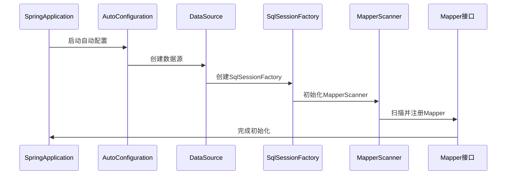
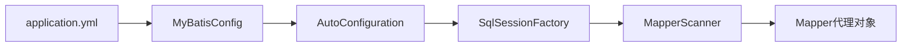

# MyBatis配置问题设计文档

## 概述

本文档分析OnlineCanteenSystem项目中MyBatis配置问题，重点解决"MyBatis需要sqlSessionFactory或sqlSessionTemplate"的错误，确保MyBatis-Plus自动配置正常工作。

## 问题描述

### 当前问题现象
- 系统启动时提示：MyBatis需要sqlSessionFactory或sqlSessionTemplate
- MyBatis-Plus的自动配置未能正常工作
- 数据库连接和Mapper接口无法正常初始化

### 影响范围
- canteen-product-service模块无法正常启动
- 产品相关的数据库操作功能不可用
- 可能影响其他依赖MyBatis的微服务模块

## 技术架构分析

### 当前配置架构

```mermaid
graph TB
    A[ProductServiceApplication] --> B[MyBatisConfig]
    A --> C[application.yml]
    B --> D[@MapperScan]
    C --> E[数据源配置]
    C --> F[MyBatis-Plus配置]
    
    G[依赖管理] --> H[mybatis-plus-boot-starter]
    G --> I[mysql-connector-j]
    G --> J[spring-boot-starter-web]
```

### 问题根源分析

#### 1. 版本兼容性问题
- Spring Boot版本：3.1.12
- MyBatis-Plus版本：3.5.2
- MySQL驱动版本：8.0.33
- 版本组合可能存在兼容性问题

#### 2. 自动配置失效原因
- 缺少必要的自动配置条件
- 组件扫描范围可能不完整
- 配置文件参数设置不当

#### 3. 依赖冲突可能性
- Maven依赖传递冲突
- Spring Boot Starter之间的版本不匹配

## 解决方案架构

### 解决方案1：版本升级与兼容性修复

#### 依赖版本调整
```xml
<!-- 在父POM中升级版本 -->
<properties>
    <spring-boot.version>3.2.8</spring-boot.version>
    <spring-cloud.version>2023.0.3</spring-cloud.version>
    <mybatis-plus.version>3.5.7</mybatis-plus.version>
</properties>
```

#### 必要依赖补充
在canteen-product-service的pom.xml中添加：
```xml
<!-- JDBC启动器 -->
<dependency>
    <groupId>org.springframework.boot</groupId>
    <artifactId>spring-boot-starter-jdbc</artifactId>
</dependency>

<!-- 事务支持 -->
<dependency>
    <groupId>org.springframework</groupId>
    <artifactId>spring-tx</artifactId>
</dependency>
```

### 解决方案2：配置优化

#### MyBatisConfig配置增强
```java
@Configuration
@EnableTransactionManagement
@MapperScan(basePackages = "com.canteen.product.mapper")
public class MyBatisConfig {
    
    @Bean
    @ConditionalOnMissingBean
    public PaginationInterceptor paginationInterceptor() {
        return new PaginationInterceptor();
    }
}
```

#### application.yml配置完善
```yaml
spring:
  datasource:
    driver-class-name: com.mysql.cj.jdbc.Driver
    url: jdbc:mysql://localhost:3306/canteen_system?useUnicode=true&characterEncoding=utf-8&useSSL=false&serverTimezone=Asia/Shanghai&allowPublicKeyRetrieval=true
    username: root
    password: 123456
    hikari:
      maximum-pool-size: 20
      minimum-idle: 5
      connection-timeout: 30000
      idle-timeout: 600000
      max-lifetime: 1800000

mybatis-plus:
  configuration:
    map-underscore-to-camel-case: true
    log-impl: org.apache.ibatis.logging.stdout.StdOutImpl
    cache-enabled: false
  global-config:
    db-config:
      logic-delete-field: deleted
      logic-delete-value: 1
      logic-not-delete-value: 0
    banner: false
  mapper-locations: classpath*:mapper/**/*.xml
  type-aliases-package: com.canteen.product.entity
```

### 解决方案3：启动类配置调整

#### 启动类注解优化
```java
@SpringBootApplication
@ComponentScan(basePackages = {"com.canteen.product", "com.canteen.common"})
@EnableAutoConfiguration
public class ProductServiceApplication {
    // 应用启动逻辑
}
```

## 数据流架构

### MyBatis组件初始化流程



### 配置加载优先级



## 测试策略

### 单元测试配置
```java
@SpringBootTest
@TestPropertySource(locations = "classpath:application-test.yml")
@Transactional
@Rollback
class MyBatisConfigTest {
    
    @Autowired
    private SqlSessionFactory sqlSessionFactory;
    
    @Autowired
    private ProductMapper productMapper;
    
    @Test
    void testSqlSessionFactoryCreation() {
        assertNotNull(sqlSessionFactory);
    }
    
    @Test
    void testMapperRegistration() {
        assertNotNull(productMapper);
    }
}
```

### 集成测试方案
- 使用TestContainers进行数据库集成测试
- 模拟完整的MyBatis操作流程
- 验证自动配置的正确性

## 监控与诊断

### 启动日志分析
关键日志监控点：
- DataSource创建日志
- SqlSessionFactory初始化日志
- Mapper扫描注册日志
- 自动配置加载日志

### 诊断工具集成
```yaml
management:
  endpoints:
    web:
      exposure:
        include: health,info,beans,configprops
  endpoint:
    health:
      show-details: always
```

### 故障排查流程

```mermaid
flowchart TD
    A[启动失败] --> B{检查日志}
    B -->|数据源错误| C[检查数据库配置]
    B -->|Mapper扫描失败| D[检查@MapperScan配置]
    B -->|版本冲突| E[检查依赖版本]
    C --> F[修复配置]
    D --> F
    E --> F
    F --> G[重新启动]
    G --> H{启动成功?}
    H -->|否| B
    H -->|是| I[验证功能]
```

## 性能优化

### 连接池配置优化
- 使用HikariCP连接池
- 合理设置连接池参数
- 配置连接泄漏检测

### MyBatis配置优化
- 启用二级缓存（根据需要）
- 配置懒加载策略
- 优化SQL映射文件

## 部署配置

### 开发环境
- 使用内嵌数据库进行本地开发
- 启用详细的SQL日志输出
- 配置自动重启机制

### 生产环境
- 使用外部MySQL数据库
- 关闭SQL日志输出
- 配置连接池监控

## 风险评估

### 高风险项
- 版本升级可能引入新的兼容性问题
- 配置变更可能影响现有功能

### 中风险项
- 性能配置调整可能影响系统性能
- 连接池配置不当可能导致连接泄漏

### 低风险项
- 日志配置调整
- 监控配置添加