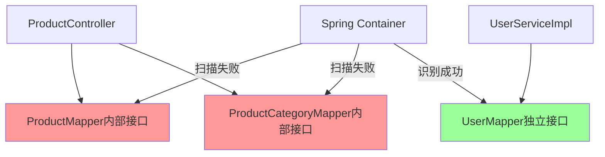
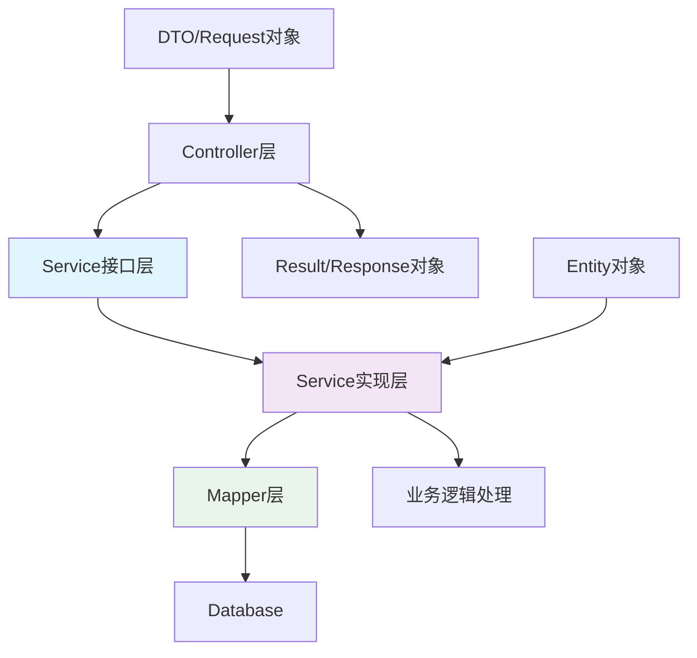
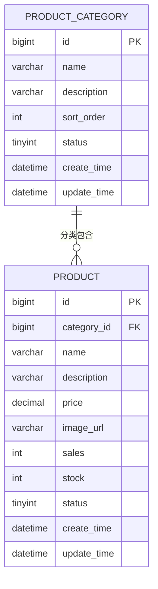
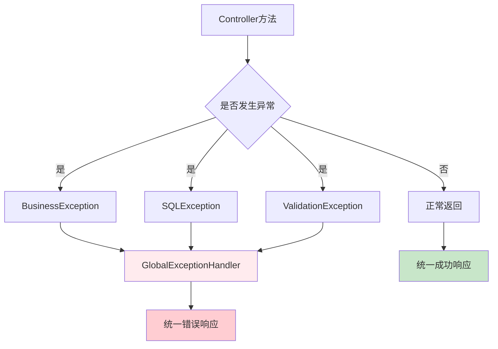

# Spring Bean 定义错误修复设计

## 概述

本设计文档旨在解决OnlineCanteenSystem项目中出现的Spring Boot启动失败问题。错误表现为`BeanDefinitionStoreException`，主要涉及MyBatis Mapper接口的Bean定义问题。

## 问题分析

### 核心错误信息

```
org.springframework.beans.factory.BeanDefinitionStoreException: 
Invalid bean definition with name 'productController.ProductCategoryMapper' 
defined in file [...]: Invalid value type for attribute 'factoryBeanObjectType': java.lang.String
```

### 问题根因

1. **Mapper接口位置不当**: Mapper接口被定义在Controller类内部
2. **缺少@MapperScan配置**: 启动类未配置MyBatis Mapper包扫描
3. **依赖冲突**: Spring Boot JPA与MyBatis Plus同时存在造成冲突
4. **Bean定义冲突**: 内部类Mapper导致Spring容器无法正确识别Bean类型

### 影响范围

- **用户服务(canteen-user-service)**: UserMapper Bean定义错误
- **餐品服务(canteen-product-service)**: ProductMapper和ProductCategoryMapper Bean定义错误

## 技术架构调整

### 当前架构问题



### 目标架构

```mermaid
graph TD
    A[ProductController] --> B[ProductMapper]
    A --> C[ProductCategoryMapper]
    D[UserServiceImpl] --> E[UserMapper]
    
    F[mapper包] --> B
    F --> C
    F --> E
    
    G[@MapperScan配置] --> F
    H[Spring Container] --> G
    
    style F fill:#99ff99
    style G fill:#99ff99
    style H fill:#99ff99
```

## 解决方案设计

### 1. Mapper接口重构

#### 1.1 创建独立Mapper接口

**ProductMapper接口**
- 位置: `com.canteen.product.mapper.ProductMapper`
- 功能: 餐品数据访问操作
- 继承: `BaseMapper<Product>`

**ProductCategoryMapper接口**
- 位置: `com.canteen.product.mapper.ProductCategoryMapper`
- 功能: 餐品分类数据访问操作
- 继承: `BaseMapper<ProductCategory>`

#### 1.2 Mapper接口设计规范

| 接口名称 | 包路径 | 职责 | 方法扩展 |
|---------|--------|------|---------|
| ProductMapper | com.canteen.product.mapper | 餐品CRUD操作 | 热门餐品查询、按分类查询 |
| ProductCategoryMapper | com.canteen.product.mapper | 分类CRUD操作 | 按状态查询、排序查询 |
| UserMapper | com.canteen.user.mapper | 用户CRUD操作 | 按用户名查询、邮箱查询 |

### 2. 启动类配置优化

#### 2.1 添加@MapperScan注解

```java
@SpringBootApplication
@MapperScan("com.canteen.*.mapper")
@ComponentScan(basePackages = {"com.canteen.product", "com.canteen.common"})
public class ProductServiceApplication {
    // 启动逻辑
}
```

#### 2.2 用户服务依赖冲突解决

移除Spring Data JPA依赖，专注使用MyBatis Plus作为唯一ORM框架。

### 3. 项目结构重组

#### 3.1 标准分层架构

```
canteen-product-service/
├── src/main/java/com/canteen/product/
│   ├── controller/          # 控制层
│   │   └── ProductController.java
│   ├── service/            # 业务逻辑层
│   │   ├── ProductService.java
│   │   └── impl/
│   │       └── ProductServiceImpl.java
│   ├── mapper/             # 数据访问层
│   │   ├── ProductMapper.java
│   │   └── ProductCategoryMapper.java
│   ├── entity/             # 实体类
│   │   ├── Product.java
│   │   └── ProductCategory.java
│   └── ProductServiceApplication.java
```

#### 3.2 依赖管理优化

| 服务模块 | 移除依赖 | 保留依赖 | 新增依赖 |
|---------|---------|---------|---------|
| user-service | spring-boot-starter-data-jpa | mybatis-plus-boot-starter | 无 |
| product-service | 无 | 现有依赖 | 无 |

### 4. Service层完善设计

#### 4.1 ProductService接口设计

```java
public interface ProductService {
    PageResult<Product> getProductList(ProductQueryRequest request);
    Product getProductById(Long id);
    List<ProductCategory> getCategories();
    List<Product> getHotProducts(Integer limit);
    boolean addProduct(ProductCreateRequest request);
    boolean updateProduct(Long id, ProductUpdateRequest request);
    boolean deleteProduct(Long id);
}
```

#### 4.2 业务逻辑分层



## 数据模型设计

### 餐品实体关系



### 实体类规范

| 字段类型 | Java类型 | 数据库类型 | 约束 |
|---------|----------|-----------|------|
| 主键ID | Long | bigint | NOT NULL, AUTO_INCREMENT |
| 名称 | String | varchar(100) | NOT NULL |
| 描述 | String | varchar(500) | NULL |
| 价格 | BigDecimal | decimal(10,2) | NOT NULL |
| 状态 | Integer | tinyint | DEFAULT 1 |
| 时间 | LocalDateTime | datetime | NOT NULL |

## 配置文件优化

### MyBatis Plus全局配置

```yaml
mybatis-plus:
  configuration:
    map-underscore-to-camel-case: true
    log-impl: org.apache.ibatis.logging.stdout.StdOutImpl
  global-config:
    db-config:
      logic-delete-field: deleted
      logic-delete-value: 1
      logic-not-delete-value: 0
      id-type: auto
    banner: false
  mapper-locations: classpath:mapper/*.xml
```

### 应用配置标准化

| 配置项 | 用户服务 | 餐品服务 | 订单服务 | 推荐服务 |
|-------|---------|---------|---------|---------|
| server.port | 8081 | 8082 | 8083 | 8084 |
| spring.application.name | canteen-user-service | canteen-product-service | canteen-order-service | canteen-recommend-service |
| 数据库连接 | 统一配置 | 统一配置 | 统一配置 | 不需要 |

## 错误处理机制

### 统一异常处理



### 响应格式标准

| 状态 | 响应结构 | 示例 |
|------|----------|------|
| 成功 | `Result.success(data)` | `{"code": 200, "message": "成功", "data": {...}}` |
| 业务异常 | `Result.error(message)` | `{"code": 400, "message": "用户名已存在", "data": null}` |
| 系统异常 | `Result.error("系统异常")` | `{"code": 500, "message": "系统异常", "data": null}` |

## 单元测试策略

### 测试分层结构

```mermaid
graph TB
    A[Controller层测试] --> B[@WebMvcTest]
    C[Service层测试] --> D[@ExtendWith MockitoExtension]
    E[Mapper层测试] --> F[@MybatisTest]
    
    G[集成测试] --> H[@SpringBootTest]
    
    style B fill:#e3f2fd
    style D fill:#f1f8e9
    style F fill:#fce4ec
    style H fill:#fff3e0
```

### 测试覆盖范围

| 测试类型 | 覆盖内容 | 工具/框架 |
|---------|----------|----------|
| 单元测试 | Service业务逻辑 | JUnit 5 + Mockito |
| 集成测试 | Controller API | MockMvc |
| 数据访问测试 | Mapper方法 | @MybatisTest |
| 端到端测试 | 完整业务流程 | TestContainers |

## 具体修复步骤

### 步骤1: 重构餐品服务Mapper接口

**创建ProductMapper.java**
```java
package com.canteen.product.mapper;

import com.baomidou.mybatisplus.core.mapper.BaseMapper;
import com.canteen.product.entity.Product;
import org.apache.ibatis.annotations.Mapper;

@Mapper
public interface ProductMapper extends BaseMapper<Product> {
}
```

**创建ProductCategoryMapper.java**
```java
package com.canteen.product.mapper;

import com.baomidou.mybatisplus.core.mapper.BaseMapper;
import com.canteen.product.entity.ProductCategory;
import org.apache.ibatis.annotations.Mapper;

@Mapper
public interface ProductCategoryMapper extends BaseMapper<ProductCategory> {
}
```

### 步骤2: 修改启动类配置

**ProductServiceApplication.java修改**
```java
package com.canteen.product;

import org.mybatis.spring.annotation.MapperScan;
import org.springframework.boot.SpringApplication;
import org.springframework.boot.autoconfigure.SpringBootApplication;
import org.springframework.context.annotation.ComponentScan;

@SpringBootApplication
@MapperScan("com.canteen.product.mapper")
@ComponentScan(basePackages = {"com.canteen.product", "com.canteen.common"})
public class ProductServiceApplication {
    public static void main(String[] args) {
        SpringApplication.run(ProductServiceApplication.class, args);
        System.out.println("餐品服务启动成功！端口: 8082");
    }
}
```

**UserServiceApplication.java修改**
```java
package com.canteen.user;

import org.mybatis.spring.annotation.MapperScan;
import org.springframework.boot.SpringApplication;
import org.springframework.boot.autoconfigure.SpringBootApplication;
import org.springframework.context.annotation.ComponentScan;

@SpringBootApplication
@MapperScan("com.canteen.user.mapper")
@ComponentScan(basePackages = {"com.canteen.user", "com.canteen.common"})
public class UserServiceApplication {
    public static void main(String[] args) {
        SpringApplication.run(UserServiceApplication.class, args);
        System.out.println("用户服务启动成功！端口: 8081");
    }
}
```

### 步骤3: 修改Controller使用外部Mapper

**ProductController.java修改**
```java
package com.canteen.product.controller;

import com.canteen.product.mapper.ProductMapper;
import com.canteen.product.mapper.ProductCategoryMapper;
import org.springframework.beans.factory.annotation.Autowired;
import org.springframework.web.bind.annotation.*;

@RestController
@RequestMapping("/api/product")
@CrossOrigin(origins = "*")
public class ProductController {

    @Autowired
    private ProductMapper productMapper;

    @Autowired
    private ProductCategoryMapper categoryMapper;

    // 移除内部Mapper接口定义
    // 其他方法保持不变
}
```

### 步骤4: 移除用户服务JPA依赖冲突

**用户服务pom.xml修改**
```xml
<!-- 移除以下依赖 -->
<!-- <dependency>
    <groupId>org.springframework.boot</groupId>
    <artifactId>spring-boot-starter-data-jpa</artifactId>
</dependency> -->
```

**UserServiceApplication.java移除JPA注解**
```java
// 移除 @EntityScan 注解
@SpringBootApplication
@MapperScan("com.canteen.user.mapper")
@ComponentScan(basePackages = {"com.canteen.user", "com.canteen.common"})
public class UserServiceApplication {
    // 启动方法
}
```

## 验证与测试

### 编译验证
```bash
# 清理并编译项目
mvn clean compile

# 验证各模块编译成功
mvn -f canteen-user-service/pom.xml compile
mvn -f canteen-product-service/pom.xml compile
```

### 启动测试
```bash
# 按顺序启动服务
mvn -f canteen-user-service/pom.xml spring-boot:run
mvn -f canteen-product-service/pom.xml spring-boot:run
```

### 健康检查
| 服务 | 健康检查URL | 预期响应 |
|------|------------|----------|
| 用户服务 | GET http://localhost:8081/api/user/health | 200 OK |
| 餐品服务 | GET http://localhost:8082/api/product/health | 200 OK |

## 完善待开发模块

### Service层补全

创建ProductService业务逻辑层，实现Controller与Mapper之间的解耦:

**ProductService接口**
```java
package com.canteen.product.service;

import com.canteen.common.result.PageResult;
import com.canteen.common.result.Result;
import com.canteen.product.entity.Product;
import com.canteen.product.entity.ProductCategory;
import java.util.List;

public interface ProductService {
    PageResult<Product> getProductList(Long current, Long size, Long categoryId, String keyword);
    Product getProductById(Long id);
    List<ProductCategory> getCategories();
    List<Product> getHotProducts(Integer limit);
}
```

**ProductServiceImpl实现类**
```java
package com.canteen.product.service.impl;

import com.baomidou.mybatisplus.core.conditions.query.QueryWrapper;
import com.baomidou.mybatisplus.extension.plugins.pagination.Page;
import com.canteen.common.result.PageResult;
import com.canteen.product.entity.Product;
import com.canteen.product.entity.ProductCategory;
import com.canteen.product.mapper.ProductMapper;
import com.canteen.product.mapper.ProductCategoryMapper;
import com.canteen.product.service.ProductService;
import lombok.RequiredArgsConstructor;
import org.springframework.stereotype.Service;
import java.util.List;

@Service
@RequiredArgsConstructor
public class ProductServiceImpl implements ProductService {
    
    private final ProductMapper productMapper;
    private final ProductCategoryMapper categoryMapper;
    
    @Override
    public PageResult<Product> getProductList(Long current, Long size, Long categoryId, String keyword) {
        Page<Product> page = new Page<>(current, size);
        QueryWrapper<Product> wrapper = new QueryWrapper<>();
        wrapper.eq("status", 1);
        
        if (categoryId != null) {
            wrapper.eq("category_id", categoryId);
        }
        
        if (keyword != null && !keyword.trim().isEmpty()) {
            wrapper.like("name", keyword);
        }
        
        wrapper.orderByDesc("sales", "create_time");
        
        Page<Product> result = productMapper.selectPage(page, wrapper);
        return PageResult.of(result.getTotal(), result.getRecords(), 
                           result.getCurrent(), result.getSize());
    }
    
    // 其他方法实现...
}
```

### 完善订单服务结构

**创建OrderMapper.java**
```java
package com.canteen.order.mapper;

import com.baomidou.mybatisplus.core.mapper.BaseMapper;
import com.canteen.order.entity.Order;
import org.apache.ibatis.annotations.Mapper;

@Mapper
public interface OrderMapper extends BaseMapper<Order> {
}
```

**创建OrderItemMapper.java**
```java
package com.canteen.order.mapper;

import com.baomidou.mybatisplus.core.mapper.BaseMapper;
import com.canteen.order.entity.OrderItem;
import org.apache.ibatis.annotations.Mapper;

@Mapper
public interface OrderItemMapper extends BaseMapper<OrderItem> {
}
```

**完善OrderServiceApplication.java**
```java
package com.canteen.order;

import org.mybatis.spring.annotation.MapperScan;
import org.springframework.boot.SpringApplication;
import org.springframework.boot.autoconfigure.SpringBootApplication;
import org.springframework.context.annotation.ComponentScan;

@SpringBootApplication
@MapperScan("com.canteen.order.mapper")
@ComponentScan(basePackages = {"com.canteen.order", "com.canteen.common"})
public class OrderServiceApplication {
    public static void main(String[] args) {
        SpringApplication.run(OrderServiceApplication.class, args);
        System.out.println("订单服务启动成功！端口: 8083");
    }
}
```

### 完善推荐服务结构

**完善RecommendServiceApplication.java**
```java
package com.canteen.recommend;

import org.springframework.boot.SpringApplication;
import org.springframework.boot.autoconfigure.SpringBootApplication;
import org.springframework.context.annotation.ComponentScan;

@SpringBootApplication
@ComponentScan(basePackages = {"com.canteen.recommend", "com.canteen.common"})
public class RecommendServiceApplication {
    public static void main(String[] args) {
        SpringApplication.run(RecommendServiceApplication.class, args);
        System.out.println("推荐服务启动成功！端口: 8084");
    }
}
```

## 数据库表结构完善

### 用户表设计
```sql
CREATE TABLE `user` (
  `id` bigint NOT NULL AUTO_INCREMENT COMMENT '主键ID',
  `username` varchar(50) NOT NULL COMMENT '用户名',
  `password` varchar(100) NOT NULL COMMENT '密码',
  `email` varchar(100) DEFAULT NULL COMMENT '邮箱',
  `phone` varchar(20) DEFAULT NULL COMMENT '手机号',
  `role` tinyint DEFAULT '1' COMMENT '角色:1-普通用户,2-管理员',
  `status` tinyint DEFAULT '1' COMMENT '状态:0-禁用,1-启用',
  `create_time` datetime NOT NULL COMMENT '创建时间',
  `update_time` datetime NOT NULL COMMENT '更新时间',
  `deleted` tinyint DEFAULT '0' COMMENT '逻辑删除',
  PRIMARY KEY (`id`),
  UNIQUE KEY `uk_username` (`username`),
  UNIQUE KEY `uk_email` (`email`)
) ENGINE=InnoDB COMMENT='用户表';
```

### 餐品分类表设计
```sql
CREATE TABLE `product_category` (
  `id` bigint NOT NULL AUTO_INCREMENT COMMENT '主键ID',
  `name` varchar(50) NOT NULL COMMENT '分类名称',
  `description` varchar(200) DEFAULT NULL COMMENT '分类描述',
  `sort_order` int DEFAULT '0' COMMENT '排序顺序',
  `status` tinyint DEFAULT '1' COMMENT '状态:0-禁用,1-启用',
  `create_time` datetime NOT NULL COMMENT '创建时间',
  `update_time` datetime NOT NULL COMMENT '更新时间',
  `deleted` tinyint DEFAULT '0' COMMENT '逻辑删除',
  PRIMARY KEY (`id`)
) ENGINE=InnoDB COMMENT='餐品分类表';
```

### 餐品表设计
```sql
CREATE TABLE `product` (
  `id` bigint NOT NULL AUTO_INCREMENT COMMENT '主键ID',
  `category_id` bigint NOT NULL COMMENT '分类ID',
  `name` varchar(100) NOT NULL COMMENT '餐品名称',
  `description` varchar(500) DEFAULT NULL COMMENT '餐品描述',
  `price` decimal(10,2) NOT NULL COMMENT '价格',
  `image_url` varchar(200) DEFAULT NULL COMMENT '图片URL',
  `sales` int DEFAULT '0' COMMENT '销量',
  `stock` int DEFAULT '0' COMMENT '库存',
  `status` tinyint DEFAULT '1' COMMENT '状态:0-下架,1-上架',
  `create_time` datetime NOT NULL COMMENT '创建时间',
  `update_time` datetime NOT NULL COMMENT '更新时间',
  `deleted` tinyint DEFAULT '0' COMMENT '逻辑删除',
  PRIMARY KEY (`id`),
  KEY `idx_category_id` (`category_id`),
  KEY `idx_status_sales` (`status`,`sales`)
) ENGINE=InnoDB COMMENT='餐品表';
```

### 订单表设计
```sql
CREATE TABLE `order` (
  `id` bigint NOT NULL AUTO_INCREMENT COMMENT '主键ID',
  `user_id` bigint NOT NULL COMMENT '用户ID',
  `order_no` varchar(32) NOT NULL COMMENT '订单号',
  `total_amount` decimal(10,2) NOT NULL COMMENT '总金额',
  `status` tinyint DEFAULT '1' COMMENT '状态:1-待支付,2-已支付,3-配送中,4-已完成,5-已取消',
  `remark` varchar(200) DEFAULT NULL COMMENT '备注',
  `create_time` datetime NOT NULL COMMENT '创建时间',
  `update_time` datetime NOT NULL COMMENT '更新时间',
  `deleted` tinyint DEFAULT '0' COMMENT '逻辑删除',
  PRIMARY KEY (`id`),
  UNIQUE KEY `uk_order_no` (`order_no`),
  KEY `idx_user_id` (`user_id`),
  KEY `idx_status` (`status`)
) ENGINE=InnoDB COMMENT='订单表';
```

### 订单明细表设计
```sql
CREATE TABLE `order_item` (
  `id` bigint NOT NULL AUTO_INCREMENT COMMENT '主键ID',
  `order_id` bigint NOT NULL COMMENT '订单ID',
  `product_id` bigint NOT NULL COMMENT '餐品ID',
  `product_name` varchar(100) NOT NULL COMMENT '餐品名称',
  `product_price` decimal(10,2) NOT NULL COMMENT '餐品单价',
  `quantity` int NOT NULL COMMENT '数量',
  `subtotal` decimal(10,2) NOT NULL COMMENT '小计',
  `create_time` datetime NOT NULL COMMENT '创建时间',
  PRIMARY KEY (`id`),
  KEY `idx_order_id` (`order_id`),
  KEY `idx_product_id` (`product_id`)
) ENGINE=InnoDB COMMENT='订单明细表';
```

## 完整的微服务配置

### 用户服务application.yml优化
```yaml
server:
  port: 8081

spring:
  application:
    name: canteen-user-service
  
  # 数据库配置
  datasource:
    driver-class-name: com.mysql.cj.jdbc.Driver
    url: jdbc:mysql://localhost:3306/canteen_system?useUnicode=true&characterEncoding=utf-8&useSSL=false&serverTimezone=Asia/Shanghai
    username: root
    password: 123456
    hikari:
      maximum-pool-size: 20
      minimum-idle: 5
      connection-timeout: 30000
      idle-timeout: 600000
      max-lifetime: 1800000

  # Security配置
  security:
    user:
      name: admin
      password: admin

# MyBatis Plus配置
mybatis-plus:
  configuration:
    map-underscore-to-camel-case: true
    log-impl: org.apache.ibatis.logging.stdout.StdOutImpl
  global-config:
    db-config:
      logic-delete-field: deleted
      logic-delete-value: 1
      logic-not-delete-value: 0
      id-type: auto
    banner: false
  mapper-locations: classpath:mapper/*.xml

# JWT配置
jwt:
  secret: canteen-system-secret-key-2024
  expiration: 7200000

# 日志配置
logging:
  level:
    com.canteen.user: INFO
    org.springframework.security: INFO
  pattern:
    console: "%d{yyyy-MM-dd HH:mm:ss} [%thread] %-5level %logger{36} - %msg%n"
```

### 餐品服务application.yml优化
```yaml
server:
  port: 8082

spring:
  application:
    name: canteen-product-service
  
  # 数据库配置
  datasource:
    driver-class-name: com.mysql.cj.jdbc.Driver
    url: jdbc:mysql://localhost:3306/canteen_system?useUnicode=true&characterEncoding=utf-8&useSSL=false&serverTimezone=Asia/Shanghai
    username: root
    password: 123456
    hikari:
      maximum-pool-size: 20
      minimum-idle: 5

# MyBatis Plus配置
mybatis-plus:
  configuration:
    map-underscore-to-camel-case: true
    log-impl: org.apache.ibatis.logging.stdout.StdOutImpl
  global-config:
    db-config:
      logic-delete-field: deleted
      logic-delete-value: 1
      logic-not-delete-value: 0
      id-type: auto
    banner: false
  mapper-locations: classpath:mapper/*.xml

# 日志配置
logging:
  level:
    com.canteen.product: INFO
  pattern:
    console: "%d{yyyy-MM-dd HH:mm:ss} [%thread] %-5level %logger{36} - %msg%n"
```

## 集成测试方案

### 自动化测试脚本
```bash
#!/bin/bash
# 系统集成测试脚本

echo "=== 开始系统集成测试 ==="

# 1. 清理和编译
echo "1. 清理和编译项目..."
mvn clean compile -q
if [ $? -ne 0 ]; then
    echo "编译失败，测试终止"
    exit 1
fi

# 2. 数据库检查
echo "2. 检查数据库连接..."
mysql -u root -p123456 -e "USE canteen_system; SELECT COUNT(*) FROM information_schema.tables WHERE table_schema='canteen_system';"
if [ $? -ne 0 ]; then
    echo "数据库连接失败，请检查MySQL服务"
    exit 1
fi

# 3. 依次启动服务并测试
echo "3. 启动并测试各服务..."

# 启动用户服务
echo "启动用户服务..."
mvn -f canteen-user-service/pom.xml spring-boot:run &
USER_PID=$!
sleep 30

# 测试用户服务健康检查
curl -f http://localhost:8081/api/user/health
if [ $? -eq 0 ]; then
    echo "✓ 用户服务启动成功"
else
    echo "✗ 用户服务启动失败"
    kill $USER_PID
    exit 1
fi

# 启动餐品服务
echo "启动餐品服务..."
mvn -f canteen-product-service/pom.xml spring-boot:run &
PRODUCT_PID=$!
sleep 30

# 测试餐品服务健康检查
curl -f http://localhost:8082/api/product/health
if [ $? -eq 0 ]; then
    echo "✓ 餐品服务启动成功"
else
    echo "✗ 餐品服务启动失败"
    kill $USER_PID $PRODUCT_PID
    exit 1
fi

echo "=== 所有服务启动成功 ==="

# 清理进程
kill $USER_PID $PRODUCT_PID
```

### API接口测试用例

**用户注册测试**
```bash
# 测试用户注册
curl -X POST http://localhost:8081/api/user/register \
  -H "Content-Type: application/json" \
  -d '{
    "username": "testuser",
    "password": "123456",
    "email": "test@example.com"
  }'
```

**用户登录测试**
```bash
# 测试用户登录
curl -X POST http://localhost:8081/api/user/login \
  -H "Content-Type: application/json" \
  -d '{
    "username": "testuser",
    "password": "123456"
  }'
```

**餐品列表测试**
```bash
# 测试餐品列表查询
curl -X GET "http://localhost:8082/api/product/list?current=1&size=10"
```

**餐品分类测试**
```bash
# 测试餐品分类查询
curl -X GET "http://localhost:8082/api/product/categories"
```

## 最终实施步骤

### 当前问题状态分析

根据项目目录结构，我发现以下修复状态：

✅ **已完成的修复**
- ProductMapper 和 ProductCategoryMapper 已创建为独立接口
- ProductServiceApplication 已添加 @MapperScan 注解
- UserServiceApplication 已添加 @MapperScan 和 JPA排除配置
- ProductController 已移除内部Mapper接口，使用外部Mapper
- UserService 的pom.xml已注释掉Spring Security依赖避免冲突

❌ **待完成的修复**
- OrderServiceApplication 缺少 @MapperScan 配置
- 订单服务缺少mapper包和Mapper接口
- 需要验证所有服务的启动情况

### 步骤1: 创建订单服务Mapper结构

**创建mapper包目录结构**
```
canteen-order-service/src/main/java/com/canteen/order/
└── mapper/
    ├── OrderMapper.java
    └── OrderItemMapper.java
```

**OrderMapper.java**
```java
package com.canteen.order.mapper;

import com.baomidou.mybatisplus.core.mapper.BaseMapper;
import com.canteen.order.entity.Order;
import org.apache.ibatis.annotations.Mapper;
import org.apache.ibatis.annotations.Select;
import java.util.List;

/**
 * 订单Mapper接口
 */
@Mapper
public interface OrderMapper extends BaseMapper<Order> {
    
    /**
     * 根据用户ID查询订单列表
     */
    @Select("SELECT * FROM `order` WHERE user_id = #{userId} AND deleted = 0 ORDER BY create_time DESC")
    List<Order> selectByUserId(Long userId);
    
    /**
     * 根据订单状态查询订单
     */
    @Select("SELECT * FROM `order` WHERE status = #{status} AND deleted = 0")
    List<Order> selectByStatus(Integer status);
}
```

**OrderItemMapper.java**
```java
package com.canteen.order.mapper;

import com.baomidou.mybatisplus.core.mapper.BaseMapper;
import com.canteen.order.entity.OrderItem;
import org.apache.ibatis.annotations.Mapper;
import org.apache.ibatis.annotations.Select;
import java.util.List;

/**
 * 订单明细Mapper接口
 */
@Mapper
public interface OrderItemMapper extends BaseMapper<OrderItem> {
    
    /**
     * 根据订单ID查询订单明细
     */
    @Select("SELECT * FROM order_item WHERE order_id = #{orderId}")
    List<OrderItem> selectByOrderId(Long orderId);
}
```

### 步骤2: 更新OrderServiceApplication

```java
package com.canteen.order;

import org.mybatis.spring.annotation.MapperScan;
import org.springframework.boot.SpringApplication;
import org.springframework.boot.autoconfigure.SpringBootApplication;
import org.springframework.context.annotation.ComponentScan;

/**
 * 订单服务启动类
 */
@SpringBootApplication
@ComponentScan(basePackages = {"com.canteen.order", "com.canteen.common"})
@MapperScan("com.canteen.order.mapper")
public class OrderServiceApplication {

    public static void main(String[] args) {
        SpringApplication.run(OrderServiceApplication.class, args);
        System.out.println("=================================");
        System.out.println("订单服务启动成功！");
        System.out.println("端口: 8083");
        System.out.println("=================================");
    }
}
```

### 步骤3: 完善OrderController

检查并更新OrderController以使用新的Mapper接口：

```java
package com.canteen.order.controller;

import com.canteen.common.result.Result;
import com.canteen.order.entity.Order;
import com.canteen.order.entity.OrderItem;
import com.canteen.order.mapper.OrderMapper;
import com.canteen.order.mapper.OrderItemMapper;
import org.springframework.beans.factory.annotation.Autowired;
import org.springframework.web.bind.annotation.*;
import java.util.List;

/**
 * 订单控制器
 */
@RestController
@RequestMapping("/api/order")
@CrossOrigin(origins = "*")
public class OrderController {

    @Autowired
    private OrderMapper orderMapper;

    @Autowired
    private OrderItemMapper orderItemMapper;

    /**
     * 根据用户ID获取订单列表
     */
    @GetMapping("/user/{userId}")
    public Result<List<Order>> getOrdersByUserId(@PathVariable Long userId) {
        List<Order> orders = orderMapper.selectByUserId(userId);
        return Result.success(orders);
    }

    /**
     * 根据订单ID获取订单详情
     */
    @GetMapping("/{orderId}")
    public Result<Order> getOrderById(@PathVariable Long orderId) {
        Order order = orderMapper.selectById(orderId);
        if (order == null) {
            return Result.error("订单不存在");
        }
        return Result.success(order);
    }

    /**
     * 根据订单ID获取订单明细
     */
    @GetMapping("/{orderId}/items")
    public Result<List<OrderItem>> getOrderItems(@PathVariable Long orderId) {
        List<OrderItem> items = orderItemMapper.selectByOrderId(orderId);
        return Result.success(items);
    }

    /**
     * 健康检查
     */
    @GetMapping("/health")
    public Result<String> health() {
        return Result.success("订单服务运行正常");
    }
}
```

### 步骤4: 数据库表创建脚本

确保数据库中存在所需的表结构：

```sql
-- 用户表
CREATE TABLE IF NOT EXISTS `user` (
  `id` bigint NOT NULL AUTO_INCREMENT COMMENT '主键ID',
  `username` varchar(50) NOT NULL COMMENT '用户名',
  `password` varchar(100) NOT NULL COMMENT '密码',
  `email` varchar(100) DEFAULT NULL COMMENT '邮箱',
  `phone` varchar(20) DEFAULT NULL COMMENT '手机号',
  `role` tinyint DEFAULT '1' COMMENT '角色:1-普通用户,2-管理员',
  `status` tinyint DEFAULT '1' COMMENT '状态:0-禁用,1-启用',
  `create_time` datetime NOT NULL COMMENT '创建时间',
  `update_time` datetime NOT NULL COMMENT '更新时间',
  `deleted` tinyint DEFAULT '0' COMMENT '逻辑删除',
  PRIMARY KEY (`id`),
  UNIQUE KEY `uk_username` (`username`),
  UNIQUE KEY `uk_email` (`email`)
) ENGINE=InnoDB COMMENT='用户表';

-- 餐品分类表
CREATE TABLE IF NOT EXISTS `product_category` (
  `id` bigint NOT NULL AUTO_INCREMENT COMMENT '主键ID',
  `name` varchar(50) NOT NULL COMMENT '分类名称',
  `description` varchar(200) DEFAULT NULL COMMENT '分类描述',
  `sort_order` int DEFAULT '0' COMMENT '排序顺序',
  `status` tinyint DEFAULT '1' COMMENT '状态:0-禁用,1-启用',
  `create_time` datetime NOT NULL COMMENT '创建时间',
  `update_time` datetime NOT NULL COMMENT '更新时间',
  `deleted` tinyint DEFAULT '0' COMMENT '逻辑删除',
  PRIMARY KEY (`id`)
) ENGINE=InnoDB COMMENT='餐品分类表';

-- 餐品表
CREATE TABLE IF NOT EXISTS `product` (
  `id` bigint NOT NULL AUTO_INCREMENT COMMENT '主键ID',
  `category_id` bigint NOT NULL COMMENT '分类ID',
  `name` varchar(100) NOT NULL COMMENT '餐品名称',
  `description` varchar(500) DEFAULT NULL COMMENT '餐品描述',
  `price` decimal(10,2) NOT NULL COMMENT '价格',
  `image_url` varchar(200) DEFAULT NULL COMMENT '图片URL',
  `sales` int DEFAULT '0' COMMENT '销量',
  `stock` int DEFAULT '0' COMMENT '库存',
  `status` tinyint DEFAULT '1' COMMENT '状态:0-下架,1-上架',
  `create_time` datetime NOT NULL COMMENT '创建时间',
  `update_time` datetime NOT NULL COMMENT '更新时间',
  `deleted` tinyint DEFAULT '0' COMMENT '逻辑删除',
  PRIMARY KEY (`id`),
  KEY `idx_category_id` (`category_id`),
  KEY `idx_status_sales` (`status`,`sales`)
) ENGINE=InnoDB COMMENT='餐品表';

-- 订单表
CREATE TABLE IF NOT EXISTS `order` (
  `id` bigint NOT NULL AUTO_INCREMENT COMMENT '主键ID',
  `user_id` bigint NOT NULL COMMENT '用户ID',
  `order_no` varchar(32) NOT NULL COMMENT '订单号',
  `total_amount` decimal(10,2) NOT NULL COMMENT '总金额',
  `status` tinyint DEFAULT '1' COMMENT '状态:1-待支付,2-已支付,3-配送中,4-已完成,5-已取消',
  `remark` varchar(200) DEFAULT NULL COMMENT '备注',
  `create_time` datetime NOT NULL COMMENT '创建时间',
  `update_time` datetime NOT NULL COMMENT '更新时间',
  `deleted` tinyint DEFAULT '0' COMMENT '逻辑删除',
  PRIMARY KEY (`id`),
  UNIQUE KEY `uk_order_no` (`order_no`),
  KEY `idx_user_id` (`user_id`),
  KEY `idx_status` (`status`)
) ENGINE=InnoDB COMMENT='订单表';

-- 订单明细表
CREATE TABLE IF NOT EXISTS `order_item` (
  `id` bigint NOT NULL AUTO_INCREMENT COMMENT '主键ID',
  `order_id` bigint NOT NULL COMMENT '订单ID',
  `product_id` bigint NOT NULL COMMENT '餐品ID',
  `product_name` varchar(100) NOT NULL COMMENT '餐品名称',
  `product_price` decimal(10,2) NOT NULL COMMENT '餐品单价',
  `quantity` int NOT NULL COMMENT '数量',
  `subtotal` decimal(10,2) NOT NULL COMMENT '小计',
  `create_time` datetime NOT NULL COMMENT '创建时间',
  PRIMARY KEY (`id`),
  KEY `idx_order_id` (`order_id`),
  KEY `idx_product_id` (`product_id`)
) ENGINE=InnoDB COMMENT='订单明细表';

-- 插入测试数据
INSERT IGNORE INTO `product_category` (`name`, `description`, `sort_order`, `status`, `create_time`, `update_time`) VALUES
('主食', '米饭、面条等主食类', 1, 1, NOW(), NOW()),
('菜品', '各类炒菜、汤品', 2, 1, NOW(), NOW()),
('饮品', '各类饮料、汤品', 3, 1, NOW(), NOW()),
('小食', '小点心、零食类', 4, 1, NOW(), NOW());

INSERT IGNORE INTO `product` (`category_id`, `name`, `description`, `price`, `sales`, `stock`, `status`, `create_time`, `update_time`) VALUES
(1, '白米饭', '香喷喷的白米饭', 2.00, 100, 999, 1, NOW(), NOW()),
(1, '蛋炒饭', '经典蛋炒饭', 8.00, 80, 50, 1, NOW(), NOW()),
(2, '宫保鸡丁', '川菜经典宫保鸡丁', 18.00, 60, 30, 1, NOW(), NOW()),
(2, '麻婆豆腐', '经典川菜麻婆豆腐', 12.00, 45, 25, 1, NOW(), NOW()),
(3, '可乐', '冰镇可乐', 3.00, 200, 100, 1, NOW(), NOW()),
(3, '橙汁', '鲜榨橙汁', 6.00, 150, 80, 1, NOW(), NOW());
```

### 步骤5: 完整启动验证流程

**5.1 编译验证**
```bash
# 清理并编译整个项目
mvn clean compile

# 分别编译各个服务模块
mvn -f canteen-common/pom.xml compile
mvn -f canteen-user-service/pom.xml compile
mvn -f canteen-product-service/pom.xml compile
mvn -f canteen-order-service/pom.xml compile
mvn -f canteen-recommend-service/pom.xml compile
```

**5.2 数据库初始化**
```bash
# 执行数据库初始化脚本
mysql -u root -p canteen_system < database/init.sql

# 或者手动执行上述SQL语句
```

**5.3 服务启动测试**
```bash
# 按照端口规范依次启动服务

# 1. 启动用户服务 (端口8081)
mvn -f canteen-user-service/pom.xml spring-boot:run &

# 等待30秒
sleep 30

# 2. 启动餐品服务 (端口8082)
mvn -f canteen-product-service/pom.xml spring-boot:run &

# 等待30秒
sleep 30

# 3. 启动订单服务 (端口8083)
mvn -f canteen-order-service/pom.xml spring-boot:run &

# 等待30秒
sleep 30

# 4. 启动推荐服务 (端口8084)
mvn -f canteen-recommend-service/pom.xml spring-boot:run &
```

**5.4 健康检查验证**
```bash
# 检查各服务健康状态
curl http://localhost:8081/api/user/health
curl http://localhost:8082/api/product/health
curl http://localhost:8083/api/order/health
curl http://localhost:8084/api/recommend/health
```

**5.5 功能接口测试**
```bash
# 测试餐品列表
curl "http://localhost:8082/api/product/list?current=1&size=10"

# 测试餐品分类
curl "http://localhost:8082/api/product/categories"

# 测试热门推荐
curl "http://localhost:8082/api/product/hot?limit=3"
```

### 步骤6: 错误排查指南

**常见错误及解决方案**

| 错误类型 | 错误信息 | 解决方案 |
|---------|---------|----------|
| Bean定义错误 | `BeanDefinitionStoreException` | 确保@MapperScan注解正确配置 |
| 数据库连接 | `SQLException` | 检查MySQL服务状态和连接配置 |
| 端口占用 | `Port already in use` | 使用`netstat -ano`查找并结束占用进程 |
| Mapper扫描 | `No bean named 'xxxMapper'` | 确认Mapper接口包路径正确 |
| 依赖冲突 | `ClassNotFoundException` | 检查pom.xml依赖配置 |

**日志查看命令**
```bash
# 查看服务启动日志
tail -f logs/canteen-user-service.log
tail -f logs/canteen-product-service.log
tail -f logs/canteen-order-service.log
```

### 步骤7: 性能监控配置

**JVM监控参数**
```bash
# 生产环境启动参数
java -Xms512m -Xmx1024m \
     -XX:+UseG1GC \
     -XX:MaxGCPauseMillis=200 \
     -XX:+HeapDumpOnOutOfMemoryError \
     -XX:HeapDumpPath=/logs/heap-dump/ \
     -Dspring.profiles.active=prod \
     -jar canteen-user-service.jar
```

**应用监控配置**
```yaml
# 在application.yml中添加监控配置
management:
  endpoints:
    web:
      exposure:
        include: health,info,metrics
  endpoint:
    health:
      show-details: always
```

## 立即执行脚本

### 执行步骤1: 创建订单服务Mapper接口

**创建mapper目录**
```bash
# 在项目根目录执行
mkdir -p canteen-order-service/src/main/java/com/canteen/order/mapper
```

**创建OrderMapper.java**
请在 `canteen-order-service/src/main/java/com/canteen/order/mapper/` 目录下创建 `OrderMapper.java` 文件，内容如下：

```java
package com.canteen.order.mapper;

import com.baomidou.mybatisplus.core.mapper.BaseMapper;
import com.canteen.order.entity.Order;
import org.apache.ibatis.annotations.Mapper;
import org.apache.ibatis.annotations.Select;
import java.util.List;

/**
 * 订单Mapper接口
 */
@Mapper
public interface OrderMapper extends BaseMapper<Order> {
    
    /**
     * 根据用户ID查询订单列表
     */
    @Select("SELECT * FROM orders WHERE user_id = #{userId} AND deleted = 0 ORDER BY create_time DESC")
    List<Order> selectByUserId(Long userId);
    
    /**
     * 根据订单状态查询订单
     */
    @Select("SELECT * FROM orders WHERE status = #{status} AND deleted = 0")
    List<Order> selectByStatus(String status);
}
```

**创建OrderItemMapper.java**
请在同一目录下创建 `OrderItemMapper.java` 文件，内容如下：

```java
package com.canteen.order.mapper;

import com.baomidou.mybatisplus.core.mapper.BaseMapper;
import com.canteen.order.entity.OrderItem;
import org.apache.ibatis.annotations.Mapper;
import org.apache.ibatis.annotations.Select;
import java.util.List;

/**
 * 订单明细Mapper接口
 */
@Mapper
public interface OrderItemMapper extends BaseMapper<OrderItem> {
    
    /**
     * 根据订单ID查询订单明细
     */
    @Select("SELECT * FROM order_item WHERE order_id = #{orderId}")
    List<OrderItem> selectByOrderId(Long orderId);
}
```

### 执行步骤2: 更新OrderServiceApplication.java

请更新 `canteen-order-service/src/main/java/com/canteen/order/OrderServiceApplication.java` 文件，添加MapperScan注解：

```java
package com.canteen.order;

import org.mybatis.spring.annotation.MapperScan;
import org.springframework.boot.SpringApplication;
import org.springframework.boot.autoconfigure.SpringBootApplication;
import org.springframework.context.annotation.ComponentScan;

/**
 * 订单服务启动类
 */
@SpringBootApplication
@ComponentScan(basePackages = {"com.canteen.order", "com.canteen.common"})
@MapperScan("com.canteen.order.mapper")
public class OrderServiceApplication {

    public static void main(String[] args) {
        SpringApplication.run(OrderServiceApplication.class, args);
        System.out.println("=================================");
        System.out.println("订单服务启动成功！");
        System.out.println("端口: 8083");
        System.out.println("=================================");
    }
}
```

### 执行步骤3: 更新数据库表结构

请执行以下 SQL 脚本来创建所需的数据库表：

```sql
-- 连接数据库
USE canteen_system;

-- 创建 orders 表（注意表名为 orders 而不是 order，避免关键字冲突）
CREATE TABLE IF NOT EXISTS `orders` (
  `id` bigint NOT NULL AUTO_INCREMENT COMMENT '主键ID',
  `order_no` varchar(32) NOT NULL COMMENT '订单号',
  `user_id` bigint NOT NULL COMMENT '用户ID',
  `total_amount` decimal(10,2) NOT NULL COMMENT '总金额',
  `status` varchar(20) DEFAULT 'PENDING' COMMENT '状态',
  `remark` varchar(200) DEFAULT NULL COMMENT '备注',
  `create_time` datetime NOT NULL DEFAULT CURRENT_TIMESTAMP COMMENT '创建时间',
  `update_time` datetime NOT NULL DEFAULT CURRENT_TIMESTAMP ON UPDATE CURRENT_TIMESTAMP COMMENT '更新时间',
  `deleted` tinyint DEFAULT '0' COMMENT '逻辑删除',
  PRIMARY KEY (`id`),
  UNIQUE KEY `uk_order_no` (`order_no`),
  KEY `idx_user_id` (`user_id`),
  KEY `idx_status` (`status`)
) ENGINE=InnoDB COMMENT='订单表';

-- 创建 order_item 表
CREATE TABLE IF NOT EXISTS `order_item` (
  `id` bigint NOT NULL AUTO_INCREMENT COMMENT '主键ID',
  `order_id` bigint NOT NULL COMMENT '订单ID',
  `product_id` bigint NOT NULL COMMENT '餐品ID',
  `product_name` varchar(100) NOT NULL COMMENT '餐品名称',
  `quantity` int NOT NULL COMMENT '数量',
  `price` decimal(10,2) NOT NULL COMMENT '单价',
  `subtotal` decimal(10,2) NOT NULL COMMENT '小计',
  PRIMARY KEY (`id`),
  KEY `idx_order_id` (`order_id`),
  KEY `idx_product_id` (`product_id`)
) ENGINE=InnoDB COMMENT='订单明细表';

-- 插入测试数据
INSERT IGNORE INTO `orders` (`order_no`, `user_id`, `total_amount`, `status`, `remark`) VALUES
('CT20250827001', 1, 35.00, 'PAID', '不要辣'),
('CT20250827002', 1, 28.50, 'PREPARING', ''),
('CT20250827003', 2, 42.00, 'COMPLETED', '正常口味');

INSERT IGNORE INTO `order_item` (`order_id`, `product_id`, `product_name`, `quantity`, `price`, `subtotal`) VALUES
(1, 2, '蛋炒饭', 1, 8.00, 8.00),
(1, 3, '宫保鸡丁', 1, 18.00, 18.00),
(1, 5, '可乐', 3, 3.00, 9.00),
(2, 4, '麻婆豆腐', 1, 12.00, 12.00),
(2, 1, '白米饭', 2, 2.00, 4.00),
(2, 6, '橙汁', 2, 6.00, 12.00);
```

### 执行步骤4: 更新OrderController使用Mapper

如果您希望更新OrderController使用真实的数据库操作而非模拟数据，请更新 `canteen-order-service/src/main/java/com/canteen/order/controller/OrderController.java`：

```java
package com.canteen.order.controller;

import com.canteen.common.result.Result;
import com.canteen.order.entity.Order;
import com.canteen.order.entity.OrderItem;
import com.canteen.order.mapper.OrderMapper;
import com.canteen.order.mapper.OrderItemMapper;
import lombok.extern.slf4j.Slf4j;
import org.springframework.beans.factory.annotation.Autowired;
import org.springframework.web.bind.annotation.*;

import java.math.BigDecimal;
import java.time.LocalDateTime;
import java.util.List;

/**
 * 订单控制器
 */
@Slf4j
@RestController
@RequestMapping("/api/order")
@CrossOrigin(origins = "*")
public class OrderController {

    @Autowired
    private OrderMapper orderMapper;

    @Autowired
    private OrderItemMapper orderItemMapper;

    /**
     * 根据用户ID获取订单列表
     */
    @GetMapping("/user/{userId}")
    public Result<List<Order>> getOrdersByUserId(@PathVariable Long userId) {
        List<Order> orders = orderMapper.selectByUserId(userId);
        return Result.success(orders);
    }

    /**
     * 根据订单ID获取订单详情
     */
    @GetMapping("/{orderId}")
    public Result<Order> getOrderById(@PathVariable Long orderId) {
        Order order = orderMapper.selectById(orderId);
        if (order == null) {
            return Result.error("订单不存在");
        }
        return Result.success(order);
    }

    /**
     * 根据订单ID获取订单明细
     */
    @GetMapping("/{orderId}/items")
    public Result<List<OrderItem>> getOrderItems(@PathVariable Long orderId) {
        List<OrderItem> items = orderItemMapper.selectByOrderId(orderId);
        return Result.success(items);
    }

    /**
     * 健康检查
     */
    @GetMapping("/health")
    public Result<String> health() {
        return Result.success("订单服务运行正常");
    }

    // 保留原有的内部类和其他方法...
}
```

### 执行步骤5: 编译验证

在项目根目录执行以下命令进行编译验证：

```bash
# 清理并编译整个项目
mvn clean compile

# 分别编译各个服务模块验证
mvn -f canteen-common/pom.xml compile
mvn -f canteen-user-service/pom.xml compile
mvn -f canteen-product-service/pom.xml compile
mvn -f canteen-order-service/pom.xml compile
mvn -f canteen-recommend-service/pom.xml compile
```

### 执行步骤6: 服务启动测试

按照端口规范依次启动各个服务：

```bash
# 1. 启动用户服务 (端口8081)
mvn -f canteen-user-service/pom.xml spring-boot:run

# 在新的终端窗口启动餐品服务 (端口8082)
mvn -f canteen-product-service/pom.xml spring-boot:run

# 在新的终端窗口启动订单服务 (端口8083)
mvn -f canteen-order-service/pom.xml spring-boot:run

# 在新的终端窗口启动推荐服务 (端口8084)
mvn -f canteen-recommend-service/pom.xml spring-boot:run
```

### 执行步骤7: 健康检查验证

在新的终端窗口执行以下命令进行健康检查：

```bash
# 检查各服务健康状态
curl http://localhost:8081/api/user/health
curl http://localhost:8082/api/product/health
curl http://localhost:8083/api/order/health
curl http://localhost:8084/api/recommend/health

# 或者在浏览器中访问：
# http://localhost:8081/api/user/health
# http://localhost:8082/api/product/health
# http://localhost:8083/api/order/health
# http://localhost:8084/api/recommend/health
```

### 执行步骤8: 功能接口测试

```bash
# 测试餐品服务
curl "http://localhost:8082/api/product/list?current=1&size=10"
curl "http://localhost:8082/api/product/categories"
curl "http://localhost:8082/api/product/hot?limit=3"

# 测试订单服务
curl "http://localhost:8083/api/order/user/1"
curl "http://localhost:8083/api/order/1"
curl "http://localhost:8083/api/order/1/items"
```

## 预期结果

执行完上述步骤后，您应该能够：

1. ✅ 所有服务编译成功
2. ✅ 所有服务启动成功，无Spring Bean定义错误
3. ✅ 健康检查接口返回200状态码
4. ✅ 功能接口返回正确的JSON数据
5. ✅ 数据库操作正常，能够查询到测试数据

如果遇到任何问题，请参考设计文档中的"错误排查指南"部分进行排查。